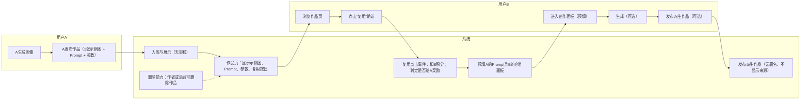
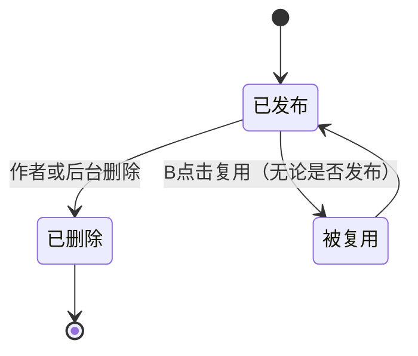


chart LR
  %% 泳道
  subgraph A[用户A]
    A1[A生成图像]
    A2[A发布作品（1张示例图 + Prompt + 参数）]
  end

  subgraph Sys[系统]
    S1[入库与展示（无审核）]
    S2["作品页展示：<br/>• 示例图（1张）<br/>• Prompt<br/>• 使用的模型名称<br/>• 发布日期<br/>• 复用消耗积分（当前值）<br/>• 复用按钮"]
    S3[复用点击事件：扣B积分；按(B用户ID, 来源作品ID)判定是否给A一次性奖励]
    S4[预填A的Prompt到B的创作面板]
    S5[发布派生作品（无署名、不显示来源）]
    S6[删除能力：作者或后台可删除作品]
  end

  subgraph B[用户B]
    B1[浏览作品页]
    B2[点击“复用”确认]
    B3[进入创作面板（预填）]
    B4[生成（可选）]
    B5[发布派生作品（可选）]
  end

  A1 --> A2 --> S1 --> S2
  S2 --> B1 --> B2 --> S3 --> S4 --> B3 --> B4 --> B5 --> S5
  S6 -.-> S2
好的，以下是根据你最新要求重制的可视化流程图（Mermaid）和功能详细说明，并附开发计划说明。将代码块粘到支持 Mermaid 的 Markdown 环境即可看到图。

一、总体流程（不审核、无署名、单示例、点击复用即扣分、仅一次奖励）


二、积分结算与防刷（按用户ID）
```mermaid
flowchart TD
  C0([用户B点击复用])
  C1{B积分余额>=当前复用扣费?}
  C1 -- 否 --> E0[失败：余额不足，提示充值或赚取积分]
  C1 -- 是 --> D1[扣除B积分（点击即扣）]

  D1 --> R1{是否已存在(A作品ID, B用户ID)的奖励记录?}
  R1 -- 是 --> A0[不给A奖励（仅扣B分）]
  R1 -- 否 --> A1[给A一次性奖励]

  A0 --> P0[返回创作面板（预填Prompt/参数）]
  A1 --> P0

  %% 发布可选
  P0 --> P1{B是否发布派生作品?}
  P1 -- 否 --> N0[流程结束：保留扣费与奖励记录]
  P1 -- 是 --> PUB[直接发布（无审核、无署名）]

  %% 删除
  PUB --> DEL{作者或后台删除?}
  DEL -- 是 --> D2[标记删除、下线作品；不回滚扣费/奖励]
  DEL -- 否 --> END[作品在线]

  %% 备注
  %% - 防刷早期方案：按(B用户ID, 来源作品ID)只奖励一次，重复点击不再给A加分
  %% - 每次点击仍扣B分（即使不生成或不发布）
```

三、状态机（无审核版）


四、功能详细说明（按你的要求落地）
- 发布（用户A）
  - 字段：标题、描述、标签（可选）、示例图（仅1张）、Prompt、Negative Prompt（可选）、模型/尺寸/CFG/步数/采样器/Seed等参数。
  - 流程：A提交后直接入库并展示（无审核）。
  - 默认：允许他人复用；无署名要求。

- 复用（用户B）
  - 点击“复用”即触发扣费，进入创作面板，系统预填A的Prompt与参数。
  - B可生成或不生成；可发布或不发布。
  - 发布后，派生作品不展示来源与署名，但系统内部记录来源作品ID与复用关系。

- 积分设置（后端统一）
  - 后端提供一个全局设置：复用积分的最低值与最高值。
  - 当前实现建议：使用一个“当前复用积分值”，必须落在[min, max]范围内；前端展示为统一扣费金额。
    - B每次点击复用：扣除“当前复用积分值”。
    - A每位B对同一来源作品仅获一次奖励：奖励金额=“当前复用积分值”。

- 防刷限制（早期版）
  - 奖励唯一性：同一(B用户ID, 来源作品ID)只奖励一次（A只得一次积分）。
  - B重复点击仍扣费（满足你的第2点），但不再给A积分。
  - 必须保留内部来源关系，用于判重与统计。
  - 可选的轻量防刷提示：复用确认弹窗，明确“该点击将扣除X积分，是否继续？”

- 删除（后端参与）
  - 作者可删除自己的作品；后台也可执行删除。
  - 删除效果：作品标记为已删除并下线、不可再复用。
  - 积分回滚：不回滚（因为扣费在点击时完成；A的奖励为一次性且已发放）。

- 不做链式奖励
  - 后续任何派生被复用都不触发对上游的奖励。

五、开发计划说明（建议三步走）
- 里程碑1：核心闭环（1周）
  - 后端
    - 模型与表：User、Work、PointsLedger、ReuseRecord（唯一奖励判定）、Settings。
    - 接口：
      - POST /works（发布）
      - GET /works/{id}（详情）
      - POST /works/{id}/reuse（点击复用：扣费+一次性奖励判定+返回预填数据）
      - POST /works/{id}/publish-derivative（创建派生作品，不展示来源）
      - DELETE /works/{id}（删除，作者或后台）
      - GET/PUT /settings/integral（min、max、currentValue）
      - GET /users/{id}/balance（余额）
    - 事务与幂等：
      - /reuse 接口需事务化：扣B分、查唯一奖励、给A分（可选）、写账本与记录。
      - 对(B, sourceWorkId)的奖励唯一性用唯一索引保证。
  - 前端
    - 作品发布页（单示例图上传）。
    - 作品详情页（示例图、Prompt、复用按钮、统一扣费金额展示）。
    - 复用确认弹窗（提示“点击即扣X积分；对原作者奖励仅第一次生效”）。
    - 创作面板（预填数据，生成与发布）。
    - 作品删除按钮（作者视角）与后台删除入口（管理视角）。
  - 测试用例
    - 余额不足点击复用应失败。
    - B首次对某作品复用：扣B分、A得分。
    - B重复复用同一作品：扣B分、A不得分。
    - 删除作品后：不可复用，既有扣费与奖励不回滚。

- 里程碑2：可视化与统计（1周）
  - 前端
    - 个人中心：余额、扣费与奖励流水。
    - 作品页：复用次数（内部统计，不显示来源用户名）。
  - 后端
    - 统计API：某作品的复用次数、收入积分；用户的支出/收入报表。
  - 风控强化（保持轻量）
    - 日志埋点：复用点击时间、IP/UA、来源作品ID。
    - 简单阈值告警：异常高频点击的用户或作品。

- 里程碑3：体验与安全（1周）
  - 复用确认弹窗支持“二次确认”或滑块，避免误触。
  - 预留审核钩子（未来可插入审核），当前默认放行。
  - 备份/回滚工具：仅对数据层，不影响既定不回滚的积分策略。

六、数据结构建议（简化版）
- users
  - id, nickname, points_balance, created_at
- works
  - id, author_id, title, description, tags, sample_image_url, prompt, negative_prompt, params(json), status(published|deleted), created_at
- work_relations
  - id, source_work_id, derivative_work_id, created_at
  - 仅内部使用；前端不展示来源
- settings
  - key: "reuse_points_min", value
  - key: "reuse_points_max", value
  - key: "reuse_points_current", value（必须在[min,max]范围内）
- points_ledger
  - id, user_id, delta(+/-), type("reuse_charge"|"reuse_reward"), ref_work_id, ref_user_id, created_at
- reuse_records
  - id, source_work_id, reuser_id, reward_granted(bool), created_at
  - 唯一索引：(source_work_id, reuser_id) 防止重复奖励

七、核心接口伪逻辑
- POST /works/{id}/reuse
  - 输入：workId, userId(B)
  - 校验：work.status == published；userB.points_balance >= reuse_points_current
  - 事务：
    - 扣B：ledger(-reuse_points_current)
    - 若不存在(reuse_records where source_work_id=workId and reuser_id=B):
      - 记reuse_records(reward_granted=true)
      - 给A：ledger(+reuse_points_current)
    - 否则：记reuse_records(reward_granted=false)
  - 返回：预填prompt/params；扣费与是否奖励A的标志
- POST /works/{id}/publish-derivative
  - 创建新work，写work_relations(source=workId, derivative=newId)
  - 前端不显示来源与署名
- DELETE /works/{id}
  - 权限：作者或后台
  - 动作：status=deleted；不可再复用；不回滚积分

八、验收标准
- 点击复用即扣分；余额不足不可复用。
- 同一B对同一来源作品仅一次给A积分；重复点击只扣B分。
- 派生作品发布不展示来源与署名。
- 删除生效：作品下线、不可复用；既有积分不回滚。
- 后端能设定复用积分的min/max与当前值，前端正确读取与展示。

如果你需要，我可以把以上 API 定义细化为 Swagger/OpenAPI 格式，或输出 draw.io 可导入的流程图文件。